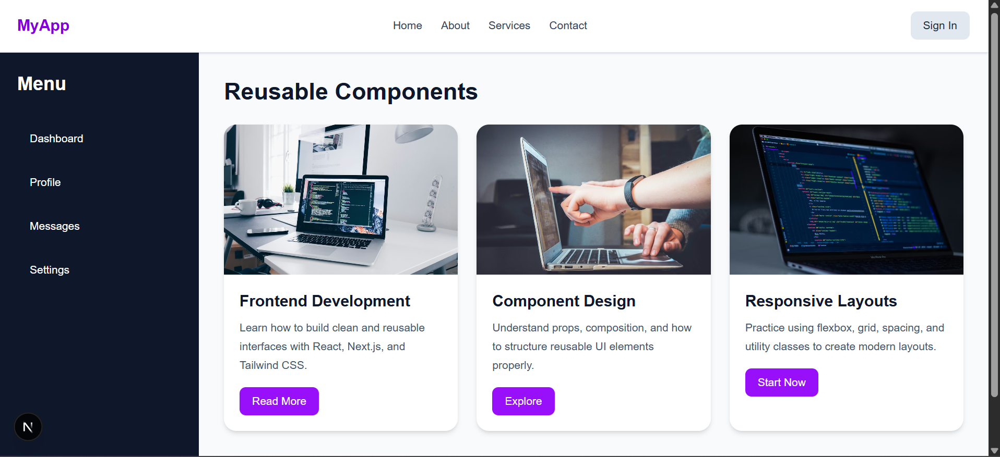

Reusable UI Components (Next.js + Tailwind)

 Project Overview
 This project demonstrates the learning and creation of ui components using Next.js and Twilwind css
The goal is to understand the process that goes behind the building and maintainance of reusable components such as cards, buttons,Navbar and Sidebar.
 Features
1. Reusable Button component with variants
2. Flexible Card component using props
3. Responsive Navbar
4. Structured Sidebar navigation
5. Clean folder structure using Next.js App Router
6. Styled using Tailwind CSS

 Tech Stack
 1. Next.js
 2. React
 3. Tailwind css

 Folder Structure

src/
├── app/
│ ├── layout.jsx
│ └── page.jsx
│
├── components/
│ └── ui/
│ ├── Button.jsx
│ ├── Card.jsx
│ ├── Navbar.jsx
│ └── Sidebar.jsx

What I Learned

1. How to build reusable components using props instead of hardcoding values
2. The importance of component structure and separation of concerns
3. How Next.js App Router organizes pages and layouts
4. How to use Tailwind CSS utility classes for:
spacing (p-, m-)
layout (flex, grid)
colors and styling
5. How to design UI components that are scalable and maintainable
6. How to combine multiple components to form a complete layout

Screenshots

Getting Started
1. Clone the repository

git clone https://github.com/Mineokah8/task.git

2. Navigate into the project

cd task

3. Install dependencies

npm install

4. Run the development server

npm run dev

5. Open in browser

http://localhost:3000

Author

Tejiri Okah

